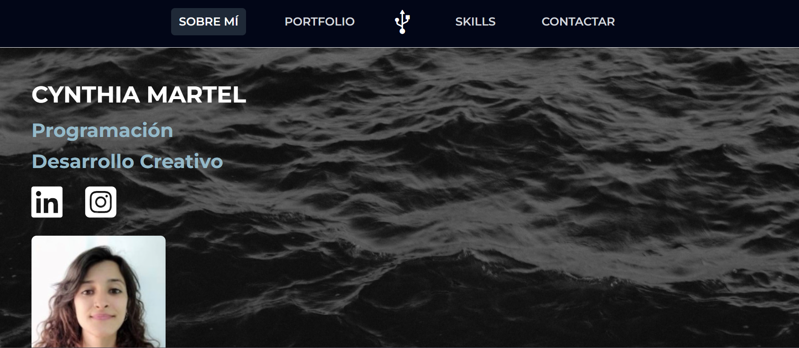

# My First HTML Project – Portfolio Template 🖥️

[Pincha aquí para acceder a la vista HTML / Click here to view the HTML version](https://cynthiamartel.github.io/)  

> **Aviso / Notice:**  
> Este es mi primer proyecto mientras aprendo HTML.  
> Es muy básico, muchas partes están incompletas y habrá que reconstruirlo, pero sirve como **plantilla inicial para mi portfolio**.  
> This is my first project while learning HTML.  
> It’s very basic, some parts are incomplete, and it will need to be rebuilt, but it serves as an **initial template for my portfolio**.

---

## 🎯 Objetivo / Goal

El objetivo principal de este proyecto fue **practicar lo más básico de HTML** y tener algo tangible para mi portfolio.  
The main goal of this project was to **practice the basics of HTML** and have something tangible for my portfolio.

---

## ⚙️ Características / Features

- Estructura HTML básica con secciones de ejemplo / Basic HTML structure with example sections.  
- Uso de imágenes y enlaces / Use of images and links.  
- Diseño sencillo con CSS mínimo / Simple design with minimal CSS.  
- Código pensado para **experimentar y aprender**, no optimizado ni finalizado / Code intended for **learning and experimentation**, not optimized or finished.  

---

## 🚧 Estado / Status

- Proyecto en construcción / Project under construction.  
- Muchas secciones están incompletas / Many sections are incomplete.  
- Sirve como **plantilla inicial para futuros proyectos** / Serves as an **initial template for future projects**.  

---

## 🛠️ Cómo usar / How to use

1. Clona o descarga este repositorio / Clone or download this repository.  
2. Abre `index.html` en tu navegador / Open `index.html` in your browser.  
3. Explora la estructura básica y úsala como referencia para aprender HTML / Explore the basic structure and use it as a reference to learn HTML.  

---

## 📚 Aprendizaje / Learning

Este proyecto me ayudó a:  
- Familiarizarme con la **estructura básica de HTML** / Get familiar with basic HTML structure.  
- Aprender a **insertar imágenes y enlaces** / Learn how to insert images and links.  
- Tener una **base inicial para futuros proyectos de portfolio** / Have an initial base for future portfolio projects.  

---

> ⚠️ Nota / Note:  
> Este proyecto es un **trabajo en progreso**, pensado para aprendizaje y experimentación. El código se mejorará y ampliará en futuras versiones.  
> This project is a **work in progress**, intended for learning and experimentation. The code will be improved and expanded in future versions.
